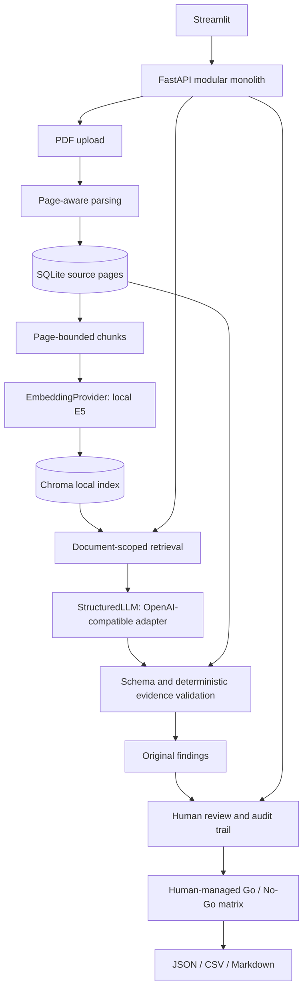

# TenderCite

**Evidence-grounded AI for public procurement documents**

TenderCite turns text-based tender PDFs into source-linked findings that a human can review
and use in a Go / No-Go matrix. Every claimed citation is checked against a stored document,
page and text passage. A valid quotation does **not** prove the model's interpretation is correct.

**Status:** unreleased development work built on v0.1. The complete workflow is implemented
and tested with deterministic model doubles. Live E5/LLM evaluation is still an open release
gate; this repository is **not yet declared v1.0.0**. See [release checks](docs/release-check.md).

## What works

- Multi-PDF upload, page-aware pypdf parsing, bounded chunks and exact source offsets.
- SQLite persistence and duplicate-upload detection by SHA-256.
- Replaceable local embeddings (default `intfloat/multilingual-e5-small`) and persistent Chroma search.
- Document-scoped retrieval with source metadata; idempotent reindexing.
- OpenAI-compatible structured extraction with Pydantic validation and per-citation checks.
- Explicit VERIFIED_QUOTE / INVALID_QUOTE / MISSING_EVIDENCE states.
- Confirm, modify or reject findings while preserving original AI output and review history.
- Human-managed Go / No-Go statuses, defaulting to CLARIFICATION_NEEDED.
- JSON, CSV and Markdown exports; Streamlit UI; FastAPI/OpenAPI.
- Synthetic evaluation corpus, offline tests, hashed dependency locks, Docker and CI definitions.

## Architecture



No agent framework, microservices or remote Chroma server is required. See
[architecture](docs/architecture.md) and [data models](docs/data-models.md).

## Quick start (Python 3.12, Linux CPU)

```bash
git clone https://github.com/nak224/tendercite.git
cd tendercite
python -m pip install uv==0.12.19
uv venv .venv
uv pip install --python .venv/bin/python --torch-backend cpu --require-hashes -r requirements-dev.lock
uv pip install --python .venv/bin/python --no-deps -e .
source .venv/bin/activate
uvicorn tendercite.main:app --host 127.0.0.1 --port 8000
# In a second terminal, activate the same environment:
streamlit run frontend/app.py --server.address=127.0.0.1
```

The first text upload/search downloads E5 model files from Hugging Face. Before live
evaluation or v1.0.0, pin a concrete, verified embedding-model commit with
`TENDERCITE_EMBEDDING_REVISION`; no revision is pinned or claimed tested yet. Allow sufficient
network access and a writable Hugging Face cache; set `HF_HOME` if necessary. If unavailable,
the source remains stored and upload returns 503: fix model access and retry upload or
`POST /api/v1/documents/{id}/index`. To work on ingestion alone, explicitly set
`TENDERCITE_RETRIEVAL_ENABLED=false` before starting the API.

For other platforms, install `.[dev,retrieval,ui]` using your platform's PyTorch instructions;
the checked-in locks target Python 3.12 Linux CPU. Revalidate on other platforms.

### Configure structured analysis

```bash
export TENDERCITE_LLM_BASE_URL=http://localhost:11434/v1
export TENDERCITE_LLM_MODEL=your-served-model
# Set TENDERCITE_LLM_API_KEY securely if your provider requires it.
```

Restart the API after changing settings. The server must support OpenAI-compatible
`/chat/completions` and JSON-schema output; compatibility with every Ollama/vLLM/LM Studio
version is not claimed. No model server is bundled. The API reads `.env`; the Streamlit
API URL must be exported as `TENDERCITE_API_URL` when overriding its default.

Analysis sends selected retrieved passages to the configured provider. Review its privacy,
retention and model-license terms first. Offline tests do not need model downloads or paid APIs.

### UI walkthrough

1. Import PDFs in **Documents**; inspect page/chunk counts.
2. Use **Search** and select source documents in the sidebar.
3. In **Analysis & review**, choose a focus and explicitly permit sending passages.
4. Inspect quotes and source pages; confirm, modify or reject each finding with a comment.
5. In **Go / No-Go**, record bidder facts, status and rationale.
6. Download **Export** results. Unreviewed/rejected findings remain explicitly labeled.

## Tests and evaluation

```bash
pytest
ruff check .
ruff format --check .
# With a working real embedding model and running API:
python -m evaluation.run --output /tmp/retrieval-evaluation.json
# Additionally uses the configured LLM, with synthetic text only:
python -m evaluation.run --analysis --output /tmp/full-evaluation.json
```

Tests exercise real SQLite/Chroma and the API/UI with deterministic embedding/LLM doubles.
The [12-case English/German evaluation](evaluation/README.md) measures retrieval Hit@k, exact source-span/type
precision/recall/F1 and evidence rates. It does not establish broad tender-analysis accuracy.

## Docker

```bash
docker compose up --build
```

Both services run as a non-root user. Host ports bind to loopback; SQLite, source PDFs,
Chroma and downloaded models live in the `tendercite-data` volume. Processes restart;
persistent files remain. See [deployment](docs/deployment.md) for configuration and proxy CAs.

## API

OpenAPI is served at `/docs`. Core routes are under `/api/v1`: `documents`, `search`,
`analyses`, `findings`, `findings/{id}/reviews`, `go-no-go`, `exports`. Liveness: `/health`.
Examples and error semantics: [API documentation](docs/api.md).

## Limitations and responsible use

- Not legal or procurement advice. Findings and bidder assessments require human review.
- Confidence is an uncalibrated model signal, not a probability of correctness.
- Quote validation proves text occurrence and source identity, not logical entailment.
- Analysis currently uses one broad query and top-k retrieval. It is not guaranteed to retrieve
  every requirement in long or multi-document tender packages; extraction is not exhaustive.
  The planned follow-up is deterministic category-specific queries followed by chunk deduplication
  ([RET-1](docs/roadmap.md#ret-1--analysis-retrieval-coverage)).
- No OCR; scans, complex layouts/tables and encrypted PDFs are not reliably supported.
- The multilingual model choice enables German/English support; German retrieval quality still
  requires evaluation. No German retrieval-quality score is claimed.
- No authentication, multi-tenancy, bidder capability inference or legal automation.
- Local documents are confidential data. Use a trusted single-user deployment; see
  [SECURITY.md](SECURITY.md) and the [dependency audit](docs/security-review.md).
- Sources referenced by analyses are retained for audit; no selective history purge UI exists.

## License and handover

TenderCite code and its explicitly identified synthetic evaluation fixture use Apache-2.0.
This does not license third-party model weights, dependencies or uploaded documents.
The default multilingual E5 model is separately MIT-licensed; review and pin a concrete revision
before live evaluation or v1.0.0, and verify its license before redistributing weights.
See [third-party notices](THIRD_PARTY_NOTICES.md), [contribution guide](CONTRIBUTING.md),
[changelog](CHANGELOG.md) and [remaining roadmap](docs/roadmap.md).
